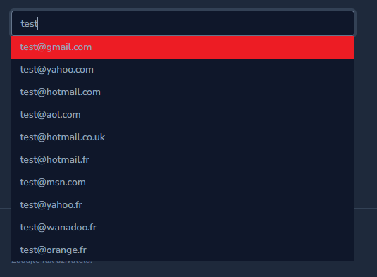

# Laravel Nova 4 Email autocomplete field




## Installation 
```shell
composer require wamesk/nova-email-autocomplete-field
```

### Publishing config

```shell
php artisan vendor:publish --provider="Wame\NovaEmailAutocompleteField\FieldServiceProvider" --tag="config"
```
## Usage

Default usage is pretty simple like every other field

By default it autocompletes domains in config file nova-email-autocomplete.php

```php
use Wame\NovaEmailAutocompleteField\Email;

Email::make('Email')
```

Alternatively you can overwrite it and use domains() method

```php
use Wame\NovaEmailAutocompleteField\Email;

Email::make('Email')
    ->domains([
        'gmail.com',
        'yahoo.com',
        ...
    ])
```
