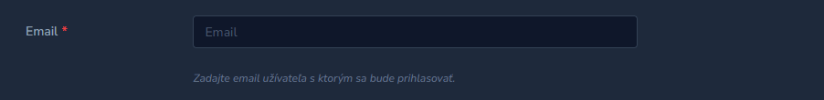

# Laravel Nova 4 Email autocomplete field




## Installation 
```shell
composer require wamesk/nova-email-autocomplete-field
```

### Publishing config

```shell
php artisan vendor:publish --provider="Wame\NovaEmailAutocompleteField\FieldServiceProvider" --tag="config"
```

## Usage

Default usage is pretty simple like every other field

By default it autocompletes domains in config file nova-email-autocomplete.php

```php
use Wame\NovaEmailAutocompleteField\Email;

Email::make('Email')
```

Alternatively you can overwrite it and use domains() method

```php
use Wame\NovaEmailAutocompleteField\Email;

Email::make('Email')
    ->domains([
        'gmail.com',
        'yahoo.com',
        ...
    ])
```

## Check unique
[https://nova.laravel.com/docs/resources/validation.html#creation-rules]()
```php
Email::make(__('user.field.email'), 'email')
    ->required()
    ->rules('required', 'email', 'max:75')
    ->creationRules('unique:users,email')
    ->updateRules('unique:users,email,{{resourceId}}')
```

A Show button will appear when a duplicate is found. 

If you do not want to display it, set the value to `false`.
```php
Email::make(__('user.field.email'), 'email')
    ->uniqueResource(false)
```

If you want to redirect to another resource such as a table.
```php
Email::make(__('customer.field.email'), 'email')
    ->uniqueResource('customers')
```